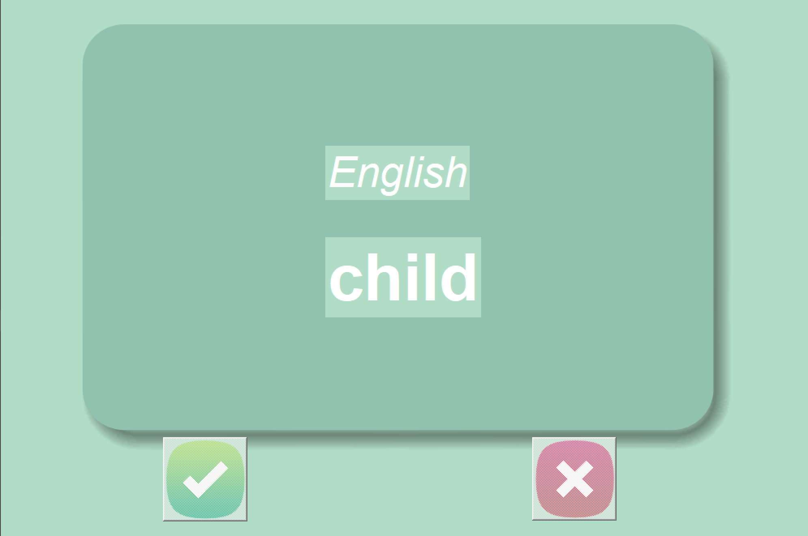

# 🗃️Flashcard Game | Day 31- 100 Days of Python

## A structured repetition-based game made using python + tkinter to support French vocabulary retention🧠

----
### 🎮**Features**
- A single player game
- Features both French and English languages
- Buttons to easily navigate across words
- Correctly guessed words are removed from list
- Score is tallied each correct guess
- High score gets stored in a text file called `data.txt`
----
### 🎮**Controls**
- `Start` - Start the game
- `✅` - Score increase and display next word
- `❌` - Display next word

---
### ❓**How Is It Run**

1. Open a terminal  
2. Navigate to the project folder:
   ```bash
   git clone https://github.com/Kaustubh-forges/Flashcard_Game.git
   cd Flashcard_Game
   python Flashcard_Game.py
   ```
3. You can also run the code in an IDLE such as Visual Studio Code or PyCharm

### 💻 **Sneak Peek**


### 🙏 **Credits**
This project is part of my journey through the 
[100 Days of Code: Python Bootcamp](https://www.udemy.com/course/100-days-of-code/) by Dr. Angela Yu.  

The project idea and structure are based on the course.
The code itself reflects my own practice, understanding, and documentation.  

